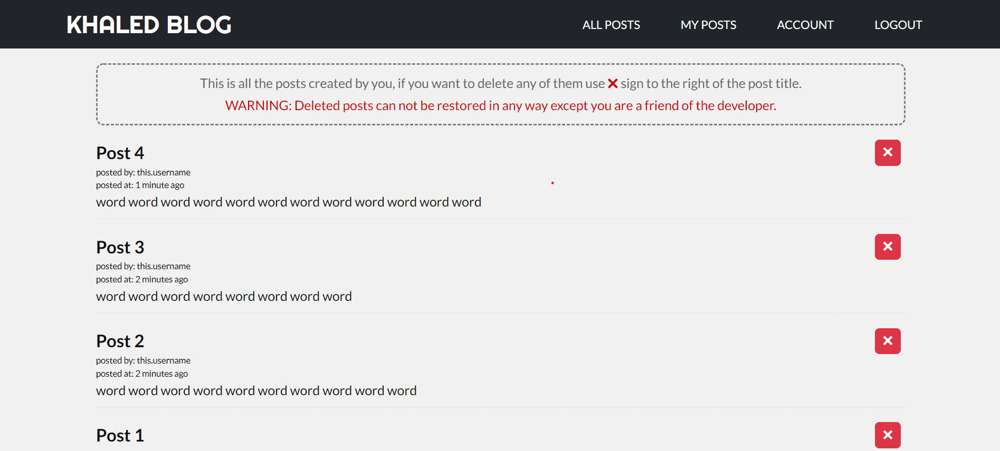
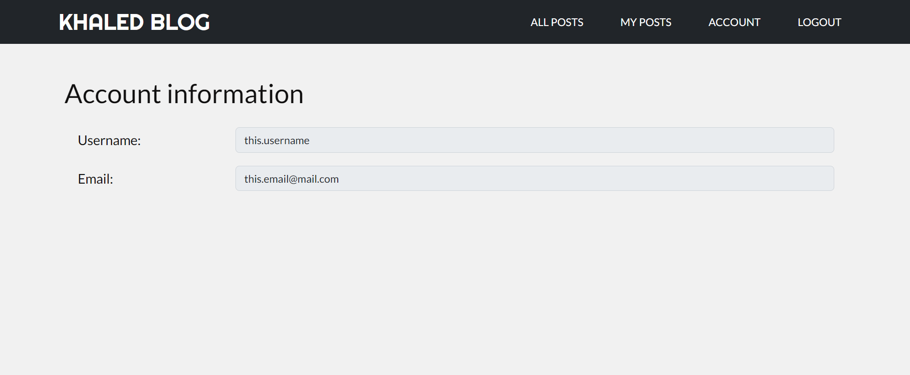

# Blog application:

Blog web application build using Node.js - MongoDB for backend,  
HTML - CSS - Bootstrap - ejs view engine for frontend.

### [**TRY HOSTED VERSION**](https://kh-blog-website.herokuapp.com)

## Important concepts implemented in this application
--- 
-  REST API
-  User authentication
-  Server side cookies 
-  MVC design pattern
-  Responsive design

## UI explained 
--- 
**All UI elements already explained in the home page of the app.**

**ALL POSTS:** this page contains all the posts created by all the users on  
this site ordered by date of creation, in this page you can use Add new  
post button to create posts.

**MY POSTS:** this page contains all the posts created by you ordered by date  
of creation, in this page you can delete any of your posts.

**ACCOUNT:** this page contains the data for the current logged in user.

## UI photos
---
- ### ALL POSTS:

- ### MY POSTS:

- ### ACCOUNT:

