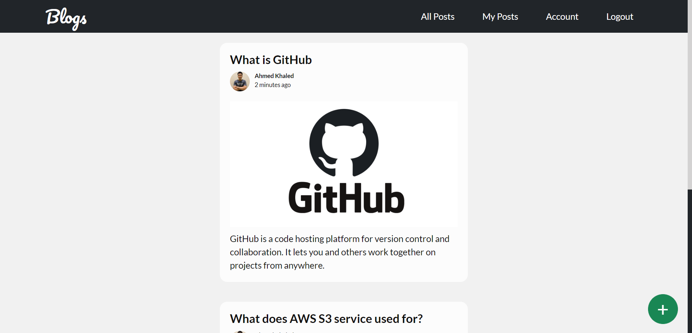
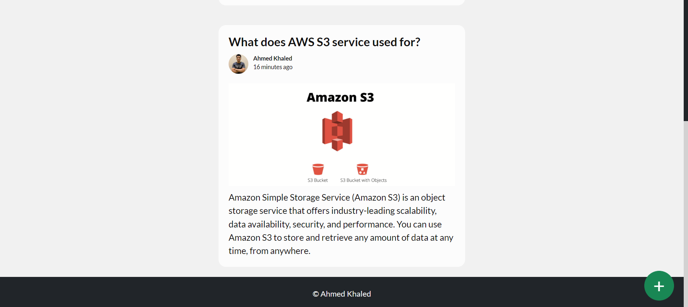
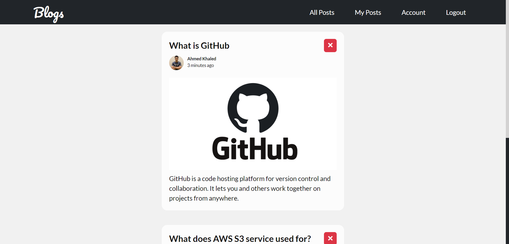
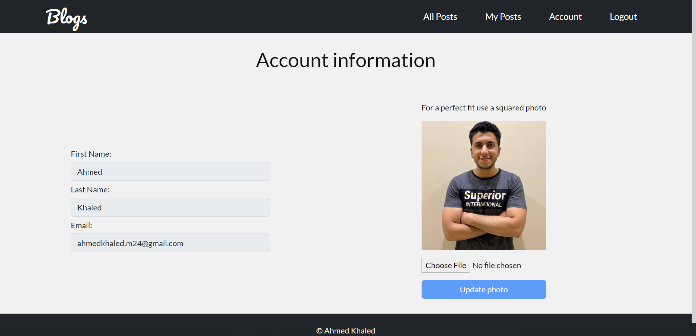
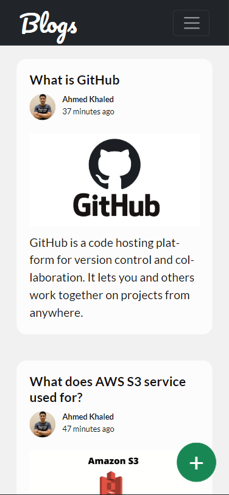
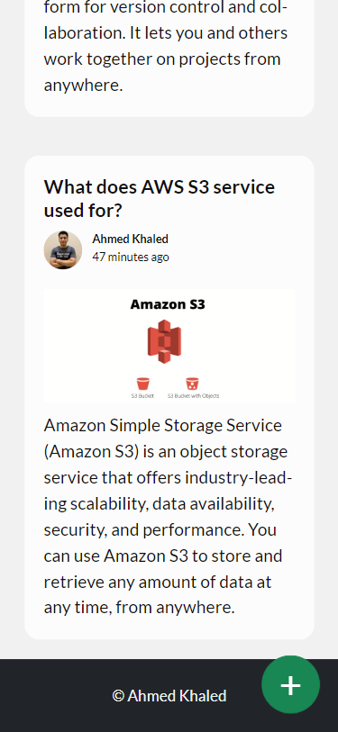
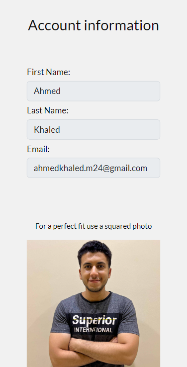

# Blog application:

Blog website build using Node.js - MongoDB - AWS S3 for backend,  
HTML - CSS - JS - Bootstrap - ejs view engine for frontend.

### [**TRY HOSTED VERSION**](https://kh-blog-website.herokuapp.com)

## Important concepts implemented in this application

-  RESTful API
-  User authentication
-  Server side cookies 
-  MVC design pattern
-  Responsive design

## UI explained 

**All Posts:** this page contains all the posts created by all the users on  
the website ordered by date of creation, in this page you can use plus button to create new posts.

**My Posts:** this page contains all the posts created by you ordered by date  
of creation, in this page you can delete any of your posts.

**Account:** this page contains the data for the current logged-in user.

## UI photos

### Desktop version:
 

### Mobile phone version:
   
   
   
   

